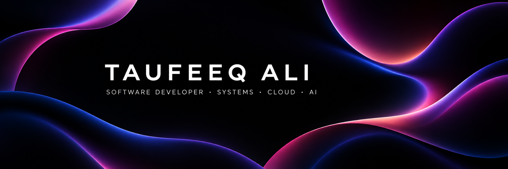

# Hi, I'm Taufeeq Ali

Software Developer at **ARGO Data**, building backend systems, developer tools, cloud infrastructure, and full-stack products.

I enjoy working below the surface of an application: designing reliable service boundaries, developer workflows, real-time systems, and the infrastructure that keeps everything running. My current work spans C++ systems programming, TypeScript applications, AI-assisted developer tools, and cloud automation.

[Portfolio](https://me.2helix.org) · [LinkedIn](https://www.linkedin.com/in/taufeeq-ali/)

## Selected work

### [Ahamkara](https://github.com/tfq26/Project-Ahamkara)

A custom C++20 game engine and multiplayer technology demo built from scratch, with an authoritative dedicated server, UDP input and snapshot networking, cross-platform input, a debug renderer, CMake workflows, and automated tests.

### [Pegasus](https://github.com/tfq26/Pegasus)

An AI-native data workspace that brings database exploration, spreadsheet-style analysis, visualization, collaboration, and natural-language querying into one product.

### [Olympus](https://github.com/tfq26/Olympus)

An AI-assisted infrastructure orchestration system connecting Flask, Node.js, Model Context Protocol, Docker, Terraform, and AWS resource operations.

### [Lyra](https://github.com/tfq26/Lyra)

A multi-agent developer workspace for clean execution streams, native diagrams, Git diffs, structured tool calls, and cross-agent coordination.

## Toolkit

**Languages:** C++, C#, TypeScript, JavaScript, Python, Go, Rust  
**Frontend:** Vue, React, Svelte, Tailwind CSS  
**Backend & data:** Node.js, Bun, Flask, SurrealDB  
**Cloud & infrastructure:** AWS, Azure, Terraform, Docker  
**Interests:** developer tools, real-time systems, AI agents, game-engine architecture, and infrastructure automation

## Currently building

I'm currently developing **Ahamkara**, validating its networking and platform foundations before expanding the renderer, tooling, and gameplay systems.

I'm always interested in ambitious engineering problems and thoughtful teams.
